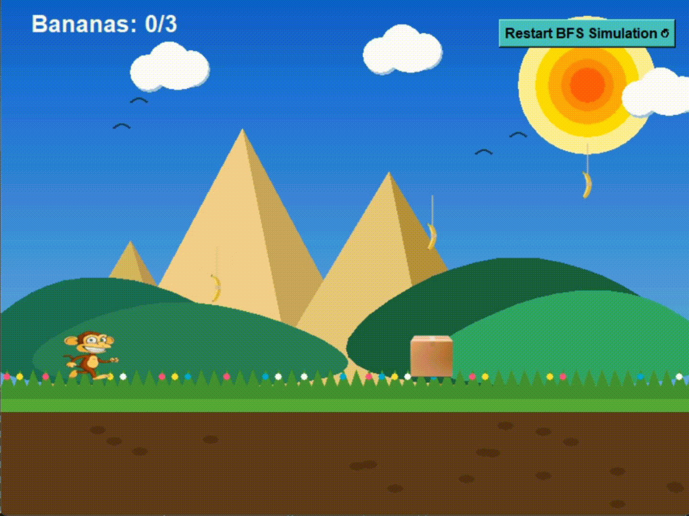

# 🐒 Monkey and Banana Problem (BFS AI Simulation)

🌐 **Live Demo:** https://Tiger0x01.github.io/Monkey-and-Banana-problem/

<p align="center">
  
</p>

<p align="center">
  <b>An interactive AI simulation demonstrating how Breadth-First Search (BFS) solves the classic Monkey and Banana problem.</b>
</p>

---

## 🚀 Overview

This project is a **Python-based interactive simulation** that visualizes how an AI agent (the monkey) uses the **BFS algorithm** to reach a goal (collect all bananas 🍌).

---

## 🧠 AI Logic (BFS)

The monkey follows a predefined BFS-based plan:
- Move to banana positions
- Jump and reach elevated objects
- Push the box strategically
- Achieve the goal state

---

## 🎮 Features

- ✅ BFS-based decision making
- ✅ Real-time animation system
- ✅ Object interaction (box pushing)
- ✅ Gravity & jumping physics
- ✅ GUI built with Tkinter
- ✅ Restart simulation button

---

## 📂 Project Structure

```text
Task Ai/
├── Assets/         # Images (monkey, banana, box, animations, demo.gif)
├── main.py         # Main game file
├── main_bfs.py     # BFS logic
├── index.html      # Optional web version
├── style.css       # Web styling
└── scripts.js      # Web scripts
````

---

## ⚙️ Installation & Run

### 1️⃣ Install dependencies

```bash
pip install pillow
```

### 2️⃣ Run the project

```bash
python main.py
```

---

## 📸 Preview

<p align="center">
  
</p>

---

## 🎯 Goal

The AI must:

* Collect all bananas 🍌
* Use the box 📦 intelligently
* Reach the final state

---

## 🛠️ Technologies Used

* Python 🐍
* Tkinter (GUI)
* PIL (Image processing)
* BFS Algorithm (AI)

---

## 📌 Future Improvements

* 🔹 Add user control mode
* 🔹 Add different AI algorithms (DFS, A*)
* 🔹 Improve graphics & animations
* 🔹 Add sound effects 🎵

---

## 👨‍💻 Author

**Mohamed Elnemr**

---

## ⭐ Support

If you like this project:

* ⭐ Star the repo
* 🍴 Fork it
* 🧠 Try improving the AI

---

## 📜 License

This project is licensed under the MIT License.


